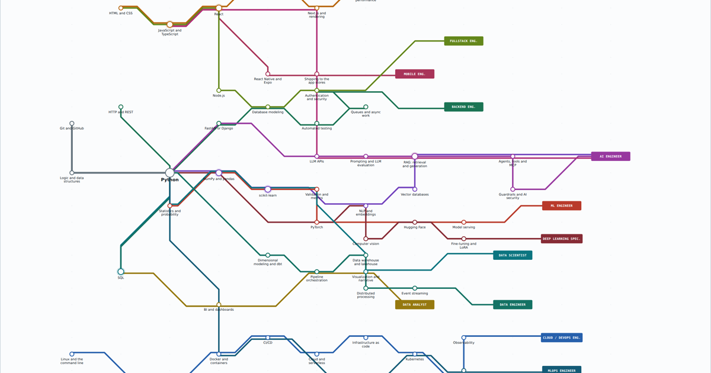

# Route Map — AI and Software Engineering

An interactive transit map of the technical routes through AI and software
engineering. **53 stations, 15 lines, 12 terminals.**

**Live:** https://fszekut.github.io/mapa-rotas-ia/ · **Português:** https://fszekut.github.io/mapa-rotas-ia/pt.html



## Why a transit map and not a roadmap

Most learning roadmaps are trees. A tree forces one parent per node, so it cannot
express the two things that actually matter when you are choosing what to learn:

- **Stations are shared.** Python, SQL, Docker and RAG each sit on several lines.
  The map draws them once and shows how many lines pass through, so the
  interchanges are visible rather than repeated.
- **The same destination has several approaches.** Three separate lines end at
  **AI Engineer** — through backend, through data, and through product. None is
  more legitimate than the others. What changes is where you are strong and where
  you are going to struggle, and job postings usually describe only one of them.

That second point is the whole reason the map exists. Filter by destination and
you see it immediately.

## How to read it

| Element | Meaning |
|---|---|
| **Station** | A technology, practice or fundamental. The circle grows with the number of lines through it |
| **Interchange** | A station on three or more lines — learn once, reuse in several directions |
| **Line** | A plausible journey to a role. A reasonable order, not a prerequisite chain |
| **Terminal** | A market role, not a certification |
| **Depth bars** | How long a station usually takes to reach a level usable in production — not conceptual difficulty |

Communication, reading other people's code, technical writing and domain
understanding have no station, because they cut across the whole map. They
usually decide more than the stack does.

## Suggestions are the point

This is one opinionated view of a contested field, and it is almost certainly
wrong somewhere. If a line is missing a station, if an ordering is off, or if a
route you actually walked is not on the map, open an issue and say so. Concrete
disagreement from people who took the route is worth more than agreement.

The whole map is data. Stations live in the `N` object and lines in `ROUTES`,
both near the top of the `<script>` block in `index.html` — editing them is
usually a one-line change.

## Running it

There is no build step and no dependencies. Open `index.html` in a browser, or:

```bash
python3 -m http.server 8000
```

Both language versions are self-contained single files. `index.html` is English,
`pt.html` is Portuguese, and the two share the same data structure and geometry.

## License

MIT — see [LICENSE](LICENSE).
